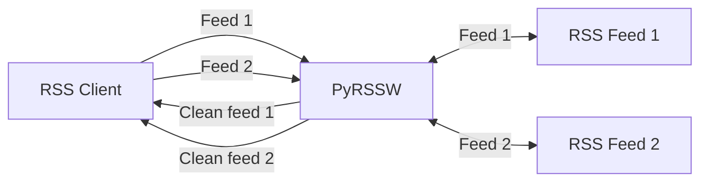

# PyRSSW

PyRSSW stands for Python RSS Wrapper.
This is a RSS proxy reworking existing RSS feeds in order to provide enhanced clean articles content (no header/footer, no menu, no ads, ...) with optional features:
- get authentified content using credentials
- display content in dark mode
- automatic insertion of tweets using the tweet a href links
- translate content (through google translate)


Best way to use PyRSSW are RSS clients like [Flym](https://github.com/FredJul/Flym) or [FeedBro](https://nodetics.com/feedbro/) which can display feeds content inline.

Get feed


It can also be used to transform anything into RSS feeds (like [RSSHub](https://github.com/DIYgod/RSSHub)).

## Getting started

### Standalone

```shell
$ pip install -r requirements.txt #first time only
$ python main.py
```

HTTP server will start listening on 8001 port.
The root page will list all available handlers.

To use the [configuration](#configuration-file) file:

```shell
$ pip install -r requirements.txt #first time only
$ python main.py -c resources/config.ini
```

### WSGI

For security purposes PyRSSW should be used through WSGI:

```shell
$ pip install -r requirements.txt #first time only
$ uwsgi --ini uwsg.ini --plugin http, python3 --http :8001 --uid www-data --gid www-data --wsgi-file server/pyrssw_wsgi.py
```

#### Behind nginx

here is a configuration sample to make it work behind nginx:

```
upstream uwsgicluster {
    server pyrssw:8001;
}

...

location ~ /pyrssw/(?<ndpath>.*) {
    include            uwsgi_params;
    uwsgi_pass         uwsgicluster;

    proxy_redirect off;
    proxy_set_header Host $host;

    proxy_set_header X-Forwarded-Host $host;
    proxy_set_header X-Forwarded-Server $host;
    proxy_set_header X-Original-URI $request_uri;
    proxy_set_header X-Forwarded-Proto $scheme;
    proxy_http_version 1.1;
    proxy_pass_request_headers on;
    proxy_set_header Connection "keep-alive";
    proxy_store off;
    proxy_pass http://uwsgicluster/$ndpath$is_args$args;

}
```

## Configuration file

The configuration file should be self explanatory enough.

```ini
#when using python httpserver

#if nothing is defined, the default hostname is used
server.listening_hostname=127.0.0.1

server.listening_port=8001

#by default serving_host=listening_host, but the serving host can be different (case of docker)
#server.serving_hostname=

#HTTPS if both of them are valid
server.certfile=resources/localhost.crt
server.keyfile=resources/localhost.key

#server.basicauth.login=
#server.basicauth.password=

#server.crypto_key=

```

At the first start, a random crypto_key is generated.
To get the crypted value of any content, use the field at the top of the root page (not working in the wsgi version so far)

## RSS Feed wrapping

PyRSSW add to rss feeds some facilities.

### Feeds enhancements

Any RSS feed provided by get_feed methods will be reworked:

- if no picture is present on the description, the picture provided in _media:content_ or in _enclosure_ tags will be added. If no _media:content_ or _enclosure_ tag exists, a picture found in google images will be proposed by querying it with the _title_ tag
- a "source" link will be added in the end of every feed item provided pointing to the original website.

### Generic parameters

Each handler can define its own parameters, but PyRSSW also provides a bunch of generic parameters for every handlers:

- `theme` (dark|light): dark/light css stylesheet is applied to the content provided by handler's get_content. If *integrationmode* is set to *div* this parameter is ignored and background color + font family will inherit css from the page integrating the article.
- `fontsize` (percent): percentage of global font size. By default 100%. fontsize=120% will increase font size of 20%
- `integrationmode` (fullpage|div): (default *div*) if set to *fullpage*, content pages css will be applied on body. If set to *div* css will be applied only inside articles content.
  ie: `/mywebsitewithnews/rss?dark=true`
- `hidetitle` (boolean): if set to true, the first h1 of the article will be hidden
  ie: `/mywebsitewithnews/rss?hidetitle=true`
- `header` (boolean): if set to true, a header will be added at the beginning of the article content with the handler name with a link to the original source. The handler name displayed comes from the handler class name separating words starting with a capital with a space. (eg: MyWebsiteWithNewsHandler will become 'My Website With News')
  ie: `/mywebsitewithnews/rss?header=true`
- `translateto` (string): if set (and valid), the content will be translated using google translate (ie: "en", "fr", "fi")
  ie: `/mywebsitewithnews/rss?translateto=fr`
- `nsfw` (boolean): if set to true, the feed thumbnail is blurred
  ie: `/mywebsitewithnews/rss?debug=true`
- the parameters provided in the feed URLs can be crypted when using sensitive information in parameters like login or passwords. (see crypto*key in configuration file section) When crypted, the parameters values are also replaced by XXX in the server logs. When crypted the value must be prefixed by **!e:**
  ie: `/mywebsitewithnews/rss?login=!e:gAAAAABe5pg7zHtpdXwS-6klKSN7d-5BZNe0V7t_DU9PbC73ZSZxqwdLHr8RvjSARhVartOu1vHGqDIAn0RcazsZj8aE2Ptqew==`
- `internallinksinpyrssw` (boolean): true by default. All internal links of the displayed content will use the content processing of pyrssw. If set to False, links will lead to original website.
- `debug` (boolean): if set to true, will display some debug information after the content
- `preview` (boolean): only useful for /rss suffix. If set to true the feed will be grapically rendered with 2 panes: one listing items, one displaying item contents.

All the parameters can be combined, ie: `/mywebsitewithnews/rss?debug=true&dark=true&translateto=fr`

## Adding new handlers

For each RSS feed managed by PyRSSW a handler must be created.

Sample handler:

```Python

class MyWebsiteWithNewsHandler(PyRSSWRequestHandler):
    """Handler for 'My Website with news'

    Handler name: mywebsitewithnews <= automatically generated from MyWebsiteWithNewsHandler

    RSS parameters:
     - filter: flowers, sports, geek
       eg :
         - /mywebsitewithnews/rss?filter=flowers             #only feeds about flowers
         - /mywebsitewithnews/rss?filter=flowers,sports      #only feeds about flowers and sports

    To provide a RSS feed, the website is webscraped.
    """

    def get_original_website(self) -> str:
        return "https://www.mywebsitewithnews.com/"

    def get_rss_url(self) -> str:
        return "https://www.mywebsitewithnews.com/rss.xml"

    @staticmethod
    def get_favicon_url(parameters: Dict[str, str]) -> str:
        return "https://www.mywebsitewithnews.com/favicon.ico"

    def get_feed(self, parameters: dict, session: requests.Session) -> str:
        """Takes a dictionary of parameters and must return the xml of the rss feed

        Arguments:
            parameters {dict} -- list of parameters
            parameters {requests.Session} -- the session provided to process HTTP queries

        Returns:
            str -- the xml feed
        """

        # You can use the given session to make http queries
        # This session is created first time the http client is requesting this handler by using a generated session id cookie
        feed: str = session.get(url).text
        filters: str = ""
        if "filter" in parameters:
            filters = parameters["filter"].split(",")
            #...
            #make any change on the RSS feed

        return feed

    def get_content(self, url: str, parameters: dict, session: requests.Session) -> PyRSSWContent:
        """Takes an url and a dictionary of parameters and must return the result content.

        Arguments:
            url {str} -- url of the original content
            parameters {dict} -- list of parameters (darkmode, login, password, ...)
            parameters {requests.Session} -- the session provided to process HTTP queries

        Returns:
            PyRSSWContent -- the content reworked + a custom css if needed
        """

        content: str = session.get(url).text

        #make any change on the content
        #to test your content with mozilla readability, you can use the "reader view" feature of Firefox or install the chrome version (https://chrome.google.com/webstore/detail/reader-view/ecabifbgmdmgdllomnfinbmaellmclnh)

        return PyRSSWContent(content, ".myclass {color:blue;}")

```
This source file must be added in handlers/pyrssw_handlers directory.
The class description is used by the server to generate the root page content using _docstring_.

See [existing handlers](./pyrssw_handlers) to see what's possible with PyRSSW.

## Docker

In the provided Dockerfile, PyRSSW runs in a Docker container using wsgi.

```shell
docker build --rm -f "Dockerfile" -t pyrssw_wsgi:latest "."
docker-compose -f "docker-compose.yml" up -d --build
```
