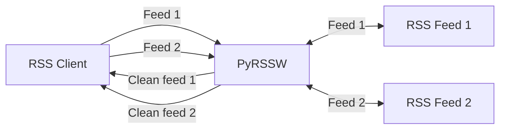

# PyRSSW

PyRSSW stands for Python RSS Wrapper.
This is a RSS proxy reworking existing RSS feeds in order to provide new feed links handling content.
The purpose is to provide an enhanced clean content (no header/footer, menu, ads, ...):
- dark mode available
- ability to use credentials to get authentified content
- automatic insertion of tweets instead of their links
- language translation available


Best way to use PyRSSW are RSS clients like [Flym](https://github.com/FredJul/Flym) or [FeedBro](https://nodetics.com/feedbro/) which can display feeds content inline.

Get feed


It can also be used to transform anything into RSS feeds (like [RSSHub](https://github.com/DIYgod/RSSHub)).

## Getting started

### Standalone

```shell
$ pip install -r requirements.txt #first time only
$ python main.py
```

HTTP server will start listening on 8001 port.
The root page will list all available handlers.

To use the [configuration](#configuration-file) file:

```shell
$ pip install -r requirements.txt #first time only
$ python main.py -c resources/config.ini
```

*Optional:*
To use all features of PyRSSW you need to setup up a mongo db, named *pyrssw*, see *storage.mongodb.url* in the [configuration file](#configuration-file).

### WSGI

For security purposes PyRSSW should be used through WSGI:

```shell
$ pip install -r requirements.txt #first time only
$ uwsgi --ini uwsg.ini --plugin http, python3 --http :8001 --uid www-data --gid www-data --wsgi-file server/pyrssw_wsgi.py
```

#### Behind nginx

here is a configuration sample to make it work behind nginx:

```
upstream uwsgicluster {
    server pyrssw:8001;
}

...

location ~ /pyrssw/(?<ndpath>.*) {
    include            uwsgi_params;
    uwsgi_pass         uwsgicluster;

    proxy_redirect off;
    proxy_set_header Host $host;

    proxy_set_header X-Forwarded-Host $host;
    proxy_set_header X-Forwarded-Server $host;
    proxy_set_header X-Original-URI $request_uri;
    proxy_set_header X-Forwarded-Proto $scheme;
    proxy_http_version 1.1;
    proxy_pass_request_headers on;
    proxy_set_header Connection "keep-alive";
    proxy_store off;
    proxy_pass http://uwsgicluster/$ndpath$is_args$args;

}
```

## Configuration file

The configuration file should be self explanatory enough.

```ini
#when using python httpserver

#if nothing is defined, the default hostname is used
server.listening_hostname=127.0.0.1

server.listening_port=8001

#by default serving_host=listening_host, but the serving host can be different (case of docker)
#server.serving_hostname=

#HTTPS if both of them are valid
server.certfile=resources/localhost.crt
server.keyfile=resources/localhost.key

#server.basicauth.login=
#server.basicauth.password=

#to store http sessions between many calls of get_feed or get_content and to store read articles, a mongo database must be set up
#this is optional, if no mongodb is available, pyrssw will work without these 2 features.
#storage.mongodb.url=mongodb://localhost:27017/

#when using userid parameter in feed urls keep trace of read articles in days, older will be deleted
storage.readarticles.age=30

#keep sessions in cache durig x minutes, older will be deleted
storage.sessions.duration=30

#server.crypto_key=

```

At the first start, a random crypto_key is generated.
To get the crypted value of any content, use the field at the top of the root page (not working in the wsgi version so far)

## RSS Feed wrapping

PyRSSW add to rss feeds some facilities.

### Feeds enhancements

Any RSS feed provided by get_feed methods will be reworked:

- if no picture is present on the description, the picture provided in _media:content_ or in _enclosure_ tags will be added. If no media:content or enclosure tag exists, a picture found in google images will be proposed by querying it with the _title_ tag
- a "source" link will be added in the end of every feed item provided pointing to the original website.

### Generic parameters

Each handle can define its own parameters, but PyRSSW also provides a bunch of generic parameters for every handlers:

- `dark` (boolean): if set to true, a dark CSS stylesheet is applied to the content provided by handler's get_content
  ie: `/dummy/rss?dark=true`
- `hidetitle` (boolean): if set to true, the first h1 of the article will be hidden
- `userid` (string): if defined every feed content URL requested for the given userid will be stored in a database in order to not be presented in the next RSS get_feed calls (is a simple way to propose only new feeds between 2 different RSS readers apps) This is very simple and not securized enough.
  A mongodb database must be up and running. See the _storage.mongodb.url_ and _storage.readarticles.age_ parameters in the [configuration file](#configuration-file).
  ie: `/dummy/rss?userid=mat`
- `translateto` (string): if set (and valid), the content will be translated using google translate (ie: "en", "fr", "fi")
- `debug` (boolean): if set to true, will display the session id at the end of the RSS feed.
- `nsfw` (boolean): if set to true, the feed thumbnail is blurred
  ie: `/dummy/rss?debug=true`
- the parameters provided in the feed URLs can be crypted when using sensitive information in parameters like login or passwords. (see crypto*key in configuration file section) When crypted, the parameters values are also replaced by XXX in the server logs. When crypted the value must be prefixed by **!e:**
  ie: `/dummy/rss?login=!e:gAAAAABe5pg7zHtpdXwS-6klKSN7d-5BZNe0V7t_DU9PbC73ZSZxqwdLHr8RvjSARhVartOu1vHGqDIAn0RcazsZj8aE2Ptqew==`

All the parameters can be combined, ie: `/dummy/rss?debug=true&dark=true&userid=mat`

## Adding new handlers

For each RSS feed managed by PyRSSW a handler must be created.

Sample handler:

```Python

class DummyHandler(PyRSSWRequestHandler):
    """Handler for Dummy, dummy website

    Handler name: dummy

    RSS parameters:
     - filter: flowers, sports, geek
       eg :
         - /dummy/rss?filter=flowers             #only feeds about flowers
         - /dummy/rss?filter=flowers,sports      #only feeds about flowers and sports

    To provide a RSS feed, the website is webscraped.
    """

    @staticmethod
    def get_handler_name() -> str:
        return "myhandlername"

    def get_original_website(self) -> str:
        return "https://www.handlerwebsite.com/"

    def get_rss_url(self) -> str:
        return "https://www.handlerwebsite.com/rss.xml"


    def get_feed(self, parameters: dict, session: requests.Session) -> str:
        """Takes a dictionary of parameters and must return the xml of the rss feed

        Arguments:
            parameters {dict} -- list of parameters
            parameters {requests.Session} -- the session provided to process HTTP queries

        Returns:
            str -- the xml feed
        """

        # You can use the given session to make http queries
        # This session is created first time the http client is requesting this handler by using a generated session id cookie
        # This session is stored in a mongo database to be reused between 2 get_feed calls (or get_content). The session will be deleted after "storage.sessions.duration" minutes (see the configuration file).
        content: str = session.get(url).text
        filters: str = ""
        if "filter" in parameters:
            filters = parameters["filter"].split(",")
            #...
            #make any change on the RSS feed

        return content

    def get_content(self, url: str, parameters: dict, session: requests.Session) -> PyRSSWContent:
        """Takes an url and a dictionary of parameters and must return the result content.

        Arguments:
            url {str} -- url of the original content
            parameters {dict} -- list of parameters (darkmode, login, password, ...)
            parameters {requests.Session} -- the session provided to process HTTP queries

        Returns:
            PyRSSWContent -- the content reworked + a custom css if needed
        """

        content: str = session.get(url).text

        #make any change on the content
        #to test your content with mozilla readability, you can use the "reader view" feature of Firefox or install the chrome version (https://chrome.google.com/webstore/detail/reader-view/ecabifbgmdmgdllomnfinbmaellmclnh)

        return PyRSSWContent(content, ".myclass {color:blue;}")

```

The class description is used by the server to generate the root page content using _docstring_.

See [existing handlers](./pyrssw_handlers) to see what's possible with PyRSSW.

## Docker

In the provided Dockerfile, PyRSSW runs in a Docker container using wsgi.

```shell
docker build --rm -f "Dockerfile" -t pyrssw_wsgi:latest "."
docker-compose -f "docker-compose.yml" up -d --build
```
